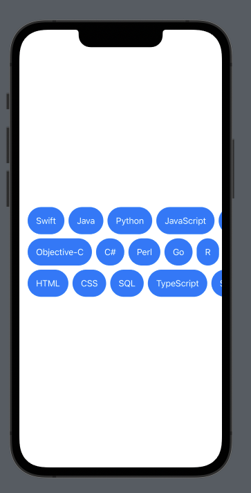

# Cloud Tags / Flowlayout / Chip Layout with SwiftUI

```swift
//
//  TagsView.swift
//  Cloud Tags / Flowlayout / Chip Layout
//
//  Created by Hasan Ali Şişeci on 21.03.2023.
//

import SwiftUI

struct TagsView<T: Hashable, V: View>: View {
    let items: [T] //Hashable items
    var lineLimit: Int //How many lines do you want
    var grouptedItems: [[T]] = [[T]]()
    let cloudTagView: (T) -> V

    init(items: [T], lineLimit: Int, cloudTagView: @escaping (T) -> V) {
        self.items = items
        self.cloudTagView = cloudTagView
        self.lineLimit = lineLimit
        self.grouptedItems = self.createGroupedItems(items, lineLimit: lineLimit)
    }

    var body: some View {
        VStack(alignment: .leading) {
            ScrollView(.horizontal, showsIndicators: false) {
                ForEach(self.grouptedItems, id: \.self) { subItems in
                    HStack {
                        ForEach(subItems, id: \.self) { word in
                            cloudTagView(word)
                        }
                        Spacer()
                    }.padding(.horizontal, UI.Spacing.p1)
                }
            }
        }
    }

    private func createGroupedItems(_ items: [T], lineLimit: Int) -> [[T]] {
        var grouptedItems: [[T]] = [[T]]()
        var tempItems: [T] = [T]()

        let temp = items.count % lineLimit
        let count = (items.count - temp) / lineLimit

        for word in items {
            if tempItems.count < count + 1 {
                tempItems.append(word)
            } else {
                grouptedItems.append(tempItems)
                tempItems.removeAll()
                tempItems.append(word)
            }
        }

        grouptedItems.append(tempItems)
        return grouptedItems
    }
}

struct TagView_Previews: PreviewProvider {
    static let items =  ["Swift", "Java", "Python", "JavaScript", "C++", "Ruby", "PHP", "Objective-C", "C#", "Perl", "Go", "R", "Kotlin", "SwiftUI", "HTML", "CSS", "SQL", "TypeScript", "Scala"]
    static var previews: some View {
        TagsView(items: TagView_Previews.items, lineLimit: 3) { item in
            Text(item)
                .padding()
                .foregroundColor(.white)
                .background(Color.random())
                .clipShape(Capsule())
        }
    }
}
```

## Tag View Screenshot

